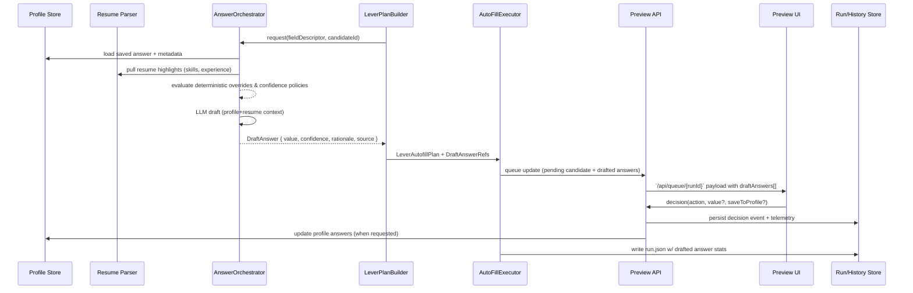

# Architecture Addendum — AI Answer Orchestration & Review Loop

## Overview
Epic 5A reshapes the roadmap so AI-drafted answers become the default path whenever profiles lack deterministic responses. This addendum documents how the existing architecture absorbs that capability without destabilising earlier epics. The answer orchestrator sits between the Lever form planner and Browser-Use executor, enriching each field with provenance, confidence, and rationale. Reviewers consume those drafts via the preview server, decide whether to apply or edit them, and optionally promote approved answers back into the profile store for future reuse. All downstream automation (Epic 5 onward) must respect the resulting metadata and guardrails.

## End-to-End Data Flow


## Service Contracts
### AnswerOrchestrator (Python)
- **Entry Point:** `AnswerOrchestrator.resolve(field: FormField, context: AnswerContext) -> DraftAnswer`
- **Precedence:** `profile.saved -> deterministic_override -> resume.enrichment -> llm_draft`
- **DraftAnswer Schema:**
  ```json
  {
    "fieldKey": "coverLetter",
    "value": "I am excited to apply...",
    "confidence": 0.74,
    "rationale": "Matches resume leadership + profile target role",
    "tokens": { "prompt": 812, "completion": 168 },
    "source": "llm_draft",
    "sourceHints": ["resume.summary", "profile.target_role"],
    "model": "openrouter/deepseek-chat-v3.1",
    "generatedAt": "2025-10-01T17:04:22Z",
    "artifactHash": "sha256:..."
  }
  ```
- **Telemetry:** emit `AI_FIELD_REQUESTED`, `AI_FIELD_DRAFTED`, `AI_FIELD_SKIPPED`, `AI_FIELD_REJECTED_LOW_CONFIDENCE` with latency and token metrics. Telemetry is ingested into `run.json.answers` and appended to `history` entries.
- **Caching:** in-run cache keyed by `(candidateId, fieldKey)` prevents duplicate LLM calls. Edits from reviewers invalidate or overwrite cache entries.

### Preview Server Enhancements (FastAPI)
- **New Endpoint:** `POST /api/queue/{runId}/candidate/{candidateId}/answers/{fieldKey}/decision`
  - Payload: `{ action: "approve"|"approve_save"|"edit"|"edit_save", value?: string, reviewerNotes?: string, lastUpdatedAt: string }`
  - Responses include updated `DraftAnswerReview` object plus refreshed queue timestamp.
  - Enforces optimistic concurrency: stale `lastUpdatedAt` returns `409` with retry guidance.
- **Queue Payload:** `draftAnswers[]` entries per candidate: `{ fieldKey, question, draftedValuePreview, confidence, rationalePreview, source, lastUpdatedAt, minConfidenceMet }`.
- **Audit Trail:** decisions append to `runs/<id>/answers/decisions.jsonl` and bubble into `run.json.decisions[]` with links to draft artifact hashes.

### Profile Store Updates
- `data/profiles/<id>.yaml` now carries:
  ```yaml
  answers:
    - fieldKey: coverLetter
      value: |
        I am excited to apply...
      source: llm_draft
      confidence: 0.82
      lastReviewedAt: 2025-10-01T18:22:11Z
      reviewerId: alex
      history:
        - valueHash: sha256:abc123
          updatedAt: 2025-09-30T20:11:08Z
          reviewerId: alex
          reason: first approval
  answersPolicies:
    min_confidence:
      review: 0.6
      auto_submit: 0.85
  ```
- Profiles without `answers` remain valid; orchestrator treats missing list as empty.

## Persistence & Telemetry
- **Run Record:**
  - `run.json.answers`: `{ drafted: number, applied: number, savedToProfile: number, averageConfidence: number, histogram: { buckets: [...] } }`
  - `queue.pending[].draftAnswers[]`: summary objects for UI quick rendering.
- **Artifacts:** Each drafted answer stored under `runs/<id>/answers/<candidate>/<field>.json` plus corresponding prompt/response pair in `runs/<id>/autofill/prompts/` (redacted for PII).
- **History Entries:** new fields `answersDrafted`, `answersApproved`, `answersSavedToProfile`, `answersConfidenceHistogram`.

## Guardrails & Governance
- **Confidence Policies:** Profile/global config exposes `answers.min_confidence.review` and `answers.min_confidence.auto_submit`. Approve actions in auto modes require `confidence >= min_confidence.auto_submit` unless an explicit reviewer override occurs.
- **Redaction:** Prompt assembly redacts SSNs, phone numbers, emails using existing `redaction` utility before shipping context to the LLM. Raw responses stored locally; history contains hashed previews only.
- **Opt-Out Controls:** Global `answers.enabled` and per-profile `answers.opt_in` flags allow operators to disable LLM drafting entirely; orchestrator short-circuits to deterministic answers when disabled.
- **Model Governance:** Allowed models enumerated in `config/models.answers[]`; token ceilings default to 2k prompt / 1k completion with per-profile overrides. Failures fall back to human-required states without blocking the run.

## Testing Strategy
- **Unit Tests:** cover precedence resolution, telemetry emission, and profile serialization (including round-tripping `answers[]`).
- **Contract Tests:** ensure API payloads for `draftAnswers[]` and decision endpoint stay consistent; optimistic concurrency scenarios validated.
- **Integration Tests:** simulated candidates exercising deterministic, resume-derived, and LLM-derived branches; verifies that reviewer edits update both orchestrator cache and persisted artifacts.
- **UI Tests:** Vitest + RTL asserts Draft Answers panel rendering, keyboard shortcuts, and accessibility attributes (ARIA labels, focus management).
- **Analytics Fixtures:** deterministic sample telemetry ensures histogram calculations remain stable without external LLM calls.

## Dependencies & Sequencing
- Epic 5A stories must land before Epic 5 tasks that rely on drafted answers. Browser-Use executor consumes `DraftAnswerRefs`, and decision engine features in Epics 6+ read confidence metrics from the new telemetry. Scheduler/auto-submit work (Epics 7–9) must treat low-confidence drafts as mandatory human review items.

