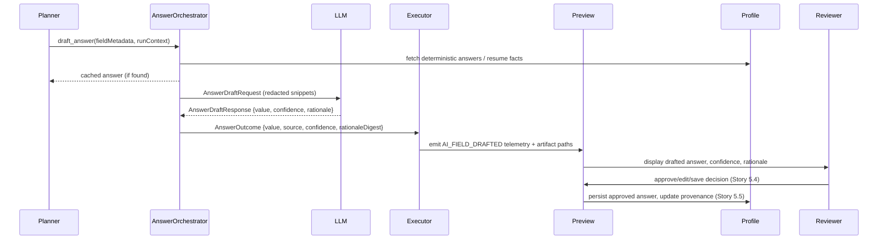

# AI Answer Orchestration Addendum

## Overview
This addendum documents how the platform drafts Lever form answers using a governed LLM fallback. It extends the Epic 5 architecture to cover the data flow from profile/resume context through the new `AnswerOrchestrator`, reviewer approvals, and profile persistence introduced in Epic 5A.

Key objectives:
- Preserve deterministic profile answers while enabling AI-generated drafts when no saved answer exists.
- Provide transparent confidence/rationale metadata for reviewers and downstream policy engines.
- Maintain privacy by hashing persisted values and redacting prompts/responses before storage.

## Data Flow


## Service Contracts
### AnswerOrchestrator
- Module: `core/answers/orchestrator.py`
- Entry point: `draft_answer(request: AnswerRequest) -> AnswerOutcome`
- Precedence order:
  1. `ProfileAnswerResolver` deterministic overrides (`source="profile"`).
  2. Resume-derived facts cached during Story 5.2.1 (`source="resume_fact"`).
  3. Cached run answers (`source="cached"`).
  4. LLM draft via `AnswerDraftClient` (`source="llm"`).
- Persists provenance to `run.json.answers[]` and writes answer artifacts under `runs/<runId>/answers/`.
- `AnswerCache` keeps per-run outcomes and exposes a `record_feedback` stub for Story 5.4 integration.
- Telemetry is emitted through `log_event` hooks so CLI/demo runs pick up `AI_FIELD_*` events automatically.

### AnswerDraftRequest
```python
class AnswerDraftRequest(BaseModel):
    run_id: str
    field_id: str
    question: str
    field_type: Literal["text", "textarea", "select", "multi_select", "url", "email", "phone"]
    validation: dict[str, Any]  # regex, max_length, required, allowed_values
    resume_snippet: str  # redacted snippet <= 750 chars
    profile_snippet: str  # redacted snippet <= 750 chars
    locale: str  # e.g. "en-US"
    timezone: str
    policy: AnswerPolicy
```

### AnswerDraftResponse
```python
class AnswerDraftResponse(BaseModel):
    value: str
    confidence: condecimal(gt=0, lt=1)
    rationale: constr(max_length=512)
    citations: list[str] | None  # optional resume/profile anchors
```

### Telemetry Events
- `AI_FIELD_DRAFTED`: `{runId, fieldId, source, model, latencyMs, confidence, policy}`
- `AI_FIELD_DRAFT_FAILED`: `{runId, fieldId, reason, policy}`
- `AI_FIELD_DRAFT_SKIPPED`: `{runId, fieldId, reason}` (e.g., deterministic answer reused)
- `AI_FIELD_REVIEWED`: emitted in Story 5.4 when reviewers approve/save/edit/reject drafts.

### Run Artifacts
- `runs/<id>/answers/<fieldId>.json`: `{valueHash, source, cachedFrom, confidence, rationaleDigest, provider}`
- `runs/<id>/answers/<fieldId>.md`: reviewer summary, hashed value lengths, rationale digest, latency, and token usage.
- `runs/<id>/answers/summary.md`: aggregated run-level overview for preview UI.
- `run.json.answers[]` records `artifactPath` _and_ `markdownPath` for every drafted field so the preview API can deep-link to the sanitized markdown artifact, and sets `cachedFrom` whenever a cached outcome is reused.

## Preview & API Integration
- Preview API will expose endpoints (`POST /api/run/{id}/answers/{fieldId}/apply|save|edit|reject`) returning `AnswerOutcome` with reviewer decision metadata.
- CLI stores resolved `answerPolicy` within `run.json` to audit thresholds used during automation.
- UI surfaces drafted answers within the queue drawer with confidence bars (Story 5.4).

## Configuration
```yaml
automation:
  answerPolicies:
    enabled: true
    minConfidence: 0.75  # 0-1 float
    allowSaveToProfile: true
    allowLLMFallback: true
    model: openrouter/mistral-small
```
- CLI flags override: `--no-answer-llm`, `--min-answer-confidence`, `--answer-model`.
- Site defaults: `sites/lever/config.yaml` adds `answers.default_policy` with selectors for classification (field type hints).
- Profile YAMLs can override these policies under `automation.answerPolicies` and the resolved policy snapshot is persisted to each `run.json`.
- `Settings.base_answer_policy()` centralises default resolution so other entry points can reuse the policy without duplicating parsing logic.

## Security & Privacy
- Prompt builder enforces:
  - Redaction of PII via hash helpers (no raw addresses, phone numbers, or email bodies).
  - Token cap ≤ 1,500 tokens to avoid excessive cost/leakage.
  - Timeout ≤ 8s with retries (max 2) before falling back to deterministic path.
- Responses stored as hashed lengths; raw text only lives in Browser-Use memory until the field is filled.
- Confidence thresholds guard full auto-submit: fields below threshold require reviewer approval before submission.

## Testing Strategy
- Unit tests mock `AnswerDraftClient` for success, validation failure, timeout, and provider errors.
- Integration tests ensure orchestrator wiring within `AutofillExecutor` respects resume-first workflow and updates telemetry/artifacts.
- Contract fixtures recorded under `core/tests/fixtures/lever/answers/` support deterministic regression across Lever variants.
- QA scripts validate that saved prompts omit PII and that reviewer approvals update profile provenance correctly.
- New pytest suites: `core/tests/test_answer_orchestrator.py` (precedence & success path) and `core/tests/test_answer_orchestrator_llm.py` (failure & timeout).

## Dependencies & Follow-Up
- Story 5.4 consumes `AnswerOrchestrator.record_feedback` to sync reviewer edits back to cached answers.
- Story 5.5 migrates profile schema to include `answers[].provenance` and analytics tasks.
- Decision Engine (Epic 6) will reuse `AnswerOutcome` confidence values to adjust advisory recommendations.
