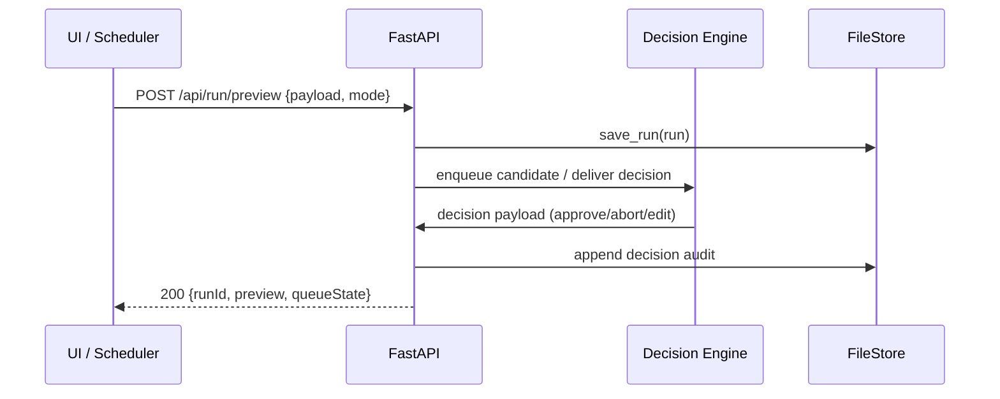

# Backend Architecture

## Service Architecture (Traditional Server)
- FastAPI app mounted inside CLI process; threads for server lifecycle if needed.
- Routes under `/api/run/*`; static UI under `/ui/*`.
- `/api/queue/*` endpoints expose the review backlog so both the UI and future schedulers can inspect or intervene without RPC hacks.

```py
# apps/preview/main.py
from fastapi import FastAPI
app = FastAPI()

@app.post("/api/run/preview")
async def start_preview(payload: dict):
    # validate, persist, return preview payload
    return {"ok": True}
```

## Database Architecture (File Repository)
- `runs/{runId}/...` folder per run
- `history/history.jsonl` append‑only with file lock
- Queue snapshots (`runs/{runId}/queue.json`) capture the state machine at key checkpoints so AI and human actions can be audited post-run.
- `decisions/` subfolder (per run) stores structured prompts/responses with redaction applied to PII-heavy context.

```py
# repositories/file_store.py
class FileStore:
    def save_run(self, run): ...
    def append_history(self, entry): ...
```

## Decision Engine Interfaces
- `DecisionEngine` protocol accepts an `ApplicationCandidate` payload (posting summary, form plan, profile guidance) and returns a `SubmissionDecision`.
- Implementations:
  - `HumanDecisionEngine`: wraps FastAPI endpoints, blocking until `/queue/{id}/decision` is received.
  - `LLMDecisionEngine`: async task that composes prompts from stored artifacts, invokes the configured model, scores the response, and emits telemetry (`AUTO_DECISION`, `AUTO_OVERRIDE`).
- Confidence thresholds, guardrail fallbacks, and per-profile run mode policy are resolved before instantiating the engine.

## Scheduler Adapter (Future Epic)
- CLI exposes `scheduler plan` and `scheduler run` commands that output OS-native instructions (Windows Task Scheduler XML, cron snippet).
- FastAPI remains stateless; scheduled runs launch the CLI directly, optionally signalling progress via `/api/queue/heartbeat` so the UI can display autop-run status when opened mid-run.

## Authentication and Authorization
- No user auth; local‑only.
- OpenRouter API key loaded from `.env.local` when LLM is used; AI mode requires explicit profile opt-in before the key is read.



---
