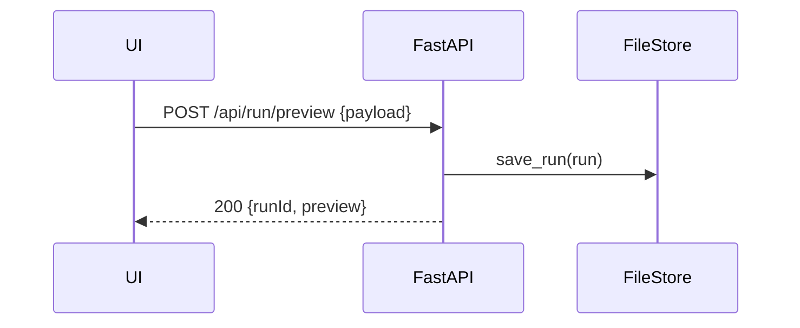

# Backend Architecture

## Service Architecture (Traditional Server)
- FastAPI app mounted inside CLI process; threads for server lifecycle if needed.
- Routes under `/api/run/*`; static UI under `/ui/*`.

```py
# apps/preview/main.py
from fastapi import FastAPI
app = FastAPI()

@app.post("/api/run/preview")
async def start_preview(payload: dict):
    # validate, persist, return preview payload
    return {"ok": True}
```

## Database Architecture (File Repository)
- `runs/{runId}/...` folder per run
- `history/history.jsonl` append‑only with file lock

```py
# repositories/file_store.py
class FileStore:
    def save_run(self, run): ...
    def append_history(self, entry): ...
```

## Authentication and Authorization
- No user auth; local‑only.
- OpenRouter API key loaded from `.env.local` when LLM is used.



---
