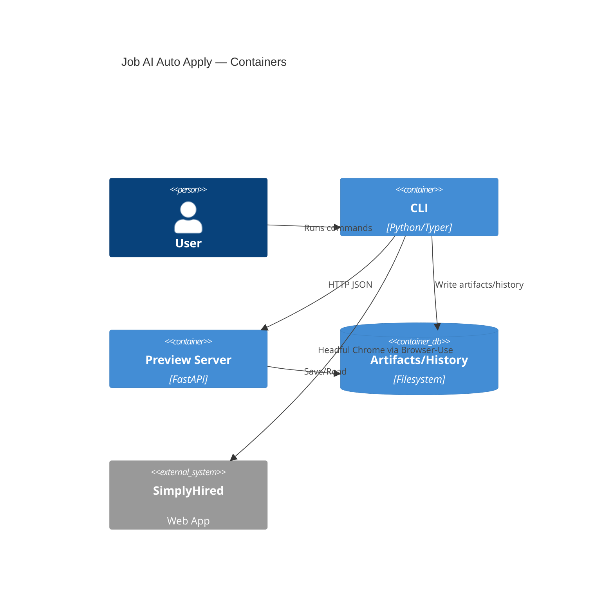

# Components

## CLI Orchestrator
**Responsibility:** Parse args, load config/profile, coordinate browser actions, manage artifacts/history.

**Key Interfaces:**
- Commands: `apply`, `profiles`, `config`, `history`
- IPC/HTTP calls to Preview server

**Dependencies:** Config loader, Profile manager, Browser‑Use wrapper, Artifact store

**Technology Stack:** Python 3.11, Typer

## Preview Server (BFF)
**Responsibility:** Serve UI, provide preview control endpoints, enforce guardrails.

**Key Interfaces:** `/api/run/*`, `/ui/*`

**Dependencies:** File repository, redaction utilities

**Technology Stack:** FastAPI, Uvicorn (embedded)

## Browser‑Use Controller
**Responsibility:** Headful Chromium automation with stealth posture; deterministic fallbacks for upload/widgets.

**Key Interfaces:** High-level actions (visit, detect Quick Apply, fill forms, upload resume, collect review screenshot)

**Dependencies:** Playwright, model driver (OpenRouter key)

**Implementation Notes:**
- The `BrowserUseController` lives in `apps/browser/controller.py` and wraps the upstream Browser-Use session with strongly typed primitives (`open_url`, `wait_for_idle`, `safe_click`).
- Configuration is resolved via `Settings` + profile overrides; Chrome sessions persist to `.local/browser/profiles/<profile>` and enforce a 1366×768 default viewport (overridable per profile).
- `python app.py apply open` bootstraps the controller, logs guardrail events, and returns a JSON session handle for follow-on automation stories.

**Technology Stack:** Browser‑Use + Playwright (Python)

## Artifact & History Store
**Responsibility:** Persist screenshots, `run.json`, HTML snapshot, redacted `actions.log`, append `history.jsonl`.

**Key Interfaces:** `save_run(run)`, `append_history(entry)`, `housekeep(retentionDays)`

**Dependencies:** Windows filesystem

**Technology Stack:** Python repository module (file‑based)

## Dedupe Service
**Responsibility:** Compute fingerprint, enforce 30‑day window, bypass when expired.

**Key Interfaces:** `should_skip(posting)`, `record_fingerprint(posting)`

**Dependencies:** Hashing, history/history.jsonl

**Technology Stack:** Python utility module

---
