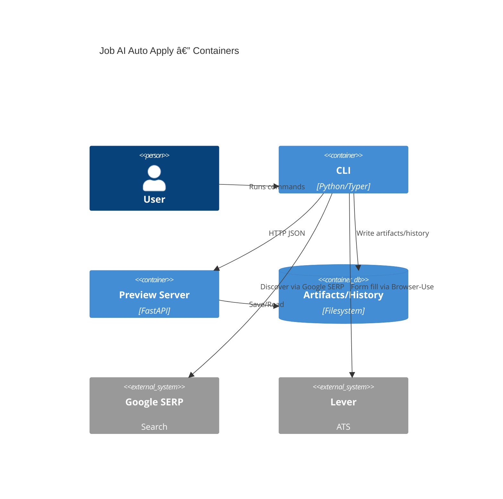

# Components

## CLI Orchestrator
**Responsibility:** Parse args, load config/profile, coordinate browser actions (including `ai_autofill` handoffs), manage artifacts/history.

**Key Interfaces:**
- Commands: `apply`, `profiles`, `config`, `history`, `scheduler plan`, `scheduler run`
- IPC/HTTP calls to Preview server and Decision Engine protocol

**Dependencies:** Config loader, Profile manager, Browser‑Use wrapper, Decision Engine, Artifact store

**Technology Stack:** Python 3.11, Typer

## Preview Server (BFF)
**Responsibility:** Serve UI, provide preview/queue control endpoints, enforce guardrails.

**Key Interfaces:** `/api/run/*`, `/api/queue/*`, `/ui/*`

**Dependencies:** File repository, redaction utilities

**Technology Stack:** FastAPI, Uvicorn (embedded)

## Browser‑Use Controller
**Responsibility:** Headful Chromium automation with stealth posture; deterministic fallbacks for upload/widgets; executes LLM-guided auto fill + submit attempts with manual handoff support.

**Key Interfaces:** High-level actions (visit, detect Quick Apply, fill forms, upload resume, collect review screenshot)

**Dependencies:** Playwright, model driver (OpenRouter key)

**Implementation Notes:**
- The `BrowserUseController` lives in `apps/browser/controller.py` and wraps the upstream Browser-Use session with strongly typed primitives (`open_url`, `wait_for_idle`, `safe_click`). It also exports `capture_review_artifacts` for the decision engine (screenshots, DOM plans, extracted summaries).
- Configuration is resolved via `Settings` + profile overrides; Chrome sessions persist to `.local/browser/profiles/<profile>` and enforce a 1366×768 default viewport (overridable per profile).
- `python app.py apply open` bootstraps the controller, logs guardrail events, and returns a JSON session handle for follow-on automation stories.
- Guardrails: `NavigationGuardrails` blocks off-allowlist URLs, suppresses multi-tab attempts, emits jittered pacing/think-time waits, and records structured telemetry (`guardrail.browser.*`) for downstream run-store ingestion.

**Technology Stack:** Browser‑Use + Playwright (Python)

### Form Fill Pipeline (Story 3.3)
- `apps/browser/controller.py` now exposes deterministic fill primitives (`focus`, `fill_text`, `set_select_value`,
  `set_radio_value`, `set_checkbox_state`, `get_field_state`) that wrap Browser-Use JS evaluation and return sanitised
  telemetry (value lengths instead of raw PII).
- `apps/cli/profiles.ProfileAnswerResolver` normalises profile YAML answers (trimmed strings, lower-case email,
  formatted phones, override fallbacks) and generates masked previews for CLI logging.
- `sites/simplyhired/form_filler.FormFillExecutor` replays persisted `FormFillPlan` artifacts, emits `FIELD_*` telemetry,
  retries once on interaction errors, and validates required fields by reading back DOM state.
- `python app.py apply open` persists a `formFill` payload to `runs/<id>/run.json` / `history.jsonl` so reviewers can track
  filled vs skipped counts per step. CLI output prints a per-step summary table for quick inspection.

### Resume Upload Pipeline (Story 3.4)
- `apps/browser/controller.BrowserUseController` adds an `upload_file` primitive that wraps Playwright's deterministic
  file chooser. It redacts file metadata (name, SHA-256, size), emits `UPLOAD_*` telemetry, honours think-time pacing,
  and surfaces guarded error details for retries without leaking the absolute path.
- `sites/simplyhired.resume_uploader.ResumeUploader` orchestrates profile resume resolution, invokes the controller
  primitive, confirms DOM attachment via `get_field_state(..., widget_type="file")`, and retries once using guardrail
  jitter before capturing a focused HTML snapshot on failure.
- `sites/lever.resume_analysis.wait_for_analysis` polls Lever-specific success selectors after upload, emitting
  `RESUME_ANALYSIS_*` telemetry and falling back to DOM stability/network idle cues before handing control back to the
  autofill executor.
- Successful uploads persist a redacted summary to `run.json` (`resumeUpload`), append a history entry, and echo a concise
  CLI status line (attempts + simulated flag). Failures capture artifacts under `runs/<id>/resume/` and bubble structured
  diagnostics back to QA for investigation.

### AutoFill Executor (Epic 5)
- `core/autofill/executor.AutofillExecutor` replays persisted `LeverAutofillPlan` intents inside Browser-Use using deterministic primitives (`focus`, `fill_text`, `set_select_value`, `set_radio_value`, `set_checkbox_state`, `upload_file`). It hashes value previews, captures before/after DOM HTML, and stores focused screenshots under `runs/<id>/autofill/` for audit.
- Telemetry now includes `AUTOFILL_PLAN_READY`, `AUTOFILL_FIELD_FILLED`, `AUTOFILL_FIELD_SKIPPED`, `AUTOFILL_UPLOAD_SUCCESS`, and `AUTOFILL_UPLOAD_FAILURE`. Each payload carries strategy metadata and redacted value hashes so analytics can distinguish deterministic fallbacks versus LLM-guided fills without leaking PII.
- CLI `python app.py apply plan --mode ai_autofill` launches headful Browser-Use, announces plan readiness, streams executor progress, and persists session handles via `RunStore.record_browser_session` (sessionId, user-data-dir, CDP endpoint, window handle) for crash recovery.
- Guardrail or action failures surface structured skip reasons while leaving the session interactive for manual intervention. Dry-run mode short-circuits executor dispatch but still emits telemetry so QA can validate sequencing without touching the DOM.

### Answer Orchestrator (Epic 5A)
- `core/answers/orchestrator.AnswerOrchestrator` resolves field answers before execution. It enforces precedence (profile overrides → resume facts → cached run answers → LLM draft) and returns `AnswerOutcome` payloads consumed by the planner/executor. Provenance is written to `run.json.answers[]` and artifacts under `runs/<id>/answers/`.
- `core/answers/models` defines `AnswerDraftRequest`/`AnswerDraftResponse` and enumerations for `AnswerSource`, `AnswerPolicy`, and `FallbackReason`. Requests include redacted resume/profile snippets, validation metadata, and locale/timezone hints; responses require bounded rationale text and machine-readable confidence (0–1 float).
- `core/answers/prompt` sanitises prompts using redaction helpers, enforces token/timeout budgets, and logs hashed previews. It relies on the shared OpenRouter client factory (`core/llm/client.py`) and supports provider metadata for future model selection.
- Telemetry events `AI_FIELD_DRAFTED`, `AI_FIELD_DRAFT_FAILED`, and `AI_FIELD_DRAFT_SKIPPED` feed monitoring dashboards. Summaries in Markdown expose rationale digests for reviewers without revealing raw PII.
- CLI config adds `automation.answerPolicies` (min confidence, allowSaveToProfile, allowLLMFallback, model). Flags `--no-answer-llm`, `--answer-model`, and `--min-answer-confidence` override profile/default settings to support QA scenarios.

## Artifact & History Store
**Responsibility:** Persist screenshots, `run.json`, HTML snapshot, redacted `actions.log`, append `history.jsonl`.

**Key Interfaces:** `save_run(run)`, `append_history(entry)`, `housekeep(retentionDays)`, `record_decision(decision)`

**Dependencies:** Windows filesystem

**Technology Stack:** Python repository module (file‑based)

**Implementation Notes:**
- `RunStore.record_browser_session` stores Browser-Use session identifiers, Chrome profile paths, CDP endpoints, and window handles in `run.json` so ai_autofill runs can be rehydrated after crashes or for telemetry review.

## Dedupe Service
**Responsibility:** Compute fingerprint, enforce 30‑day window, bypass when expired.

**Key Interfaces:** `should_skip(posting)`, `record_fingerprint(posting)`

**Dependencies:** Hashing, history/history.jsonl

**Technology Stack:** Python utility module

## Decision Engine
**Responsibility:** Evaluate each `ApplicationCandidate` and return a structured decision with rationale and confidence.

**Key Interfaces:** `decide(candidate) -> SubmissionDecision`, `record_feedback(decisionId, override)`

**Dependencies:** Profile policy (mode/thresholds), Browser-Use artifacts, AutoFillOrchestrator handoff snapshots, OpenRouter model client, preview event bus

**Technology Stack:** Python async worker (LLM), FastAPI binding (human)

## Review Queue Manager
**Responsibility:** Maintain ordered backlog of candidates, track state transitions (including `handoff_pending`), expose APIs for UI/AI schedulers, and trigger fallbacks when SLA breached.

**Key Interfaces:** `enqueue(candidate)`, `peek(mode)`, `update(decision)`, `list(filter)`

**Dependencies:** File-backed store for persistence, Decision Engine observers

**Technology Stack:** Python queue module with persisted snapshots

## Scheduler Adapter (Future Epic)
**Responsibility:** Produce OS-native schedules and monitor unattended runs.

**Key Interfaces:** `plan(profile, searchUrl, time, mode)`, `status(runId)`

**Dependencies:** CLI orchestrator, Windows Task Scheduler / cron invocation layer

**Technology Stack:** Python CLI utilities, optional PowerShell templates

---

## Browser‑Use 0.7.x Update (2025‑09‑28)
- Controller now adapts the async Browser‑Use `BrowserSession` (event‑driven) into synchronous primitives used by the CLI (`open_url`, `wait_for_idle`, `safe_click`, `get_page_html`).
- Adapter waits for `BrowserConnectedEvent`/focus; if the window is on `chrome://newtab`/Google, it triggers a CDP `Page.navigate` fallback to the target URL to avoid stalls.
- Locale/timezone are applied via environment (`LANG`/`LC_ALL`/`TZ`), `Accept-Language`, and `--lang`; deprecated `locale`/`timezone_id` kwargs are no longer passed to `BrowserSession`.
- Session backups are created under `.local/browser/backups/<profile>` and skip Chrome cache/lock files to reduce permission errors; retention is configurable.
- Readiness selectors include a 2025 variant using `data-testid` attributes to align with current SimplyHired markup.
- Release monitoring: engineers must track Browser-Use API changes via the [introduction](https://docs.browser-use.com/introduction) and [changelog](https://docs.browser-use.com/changelog) before updating selectors or DOM-mapping heuristics.

