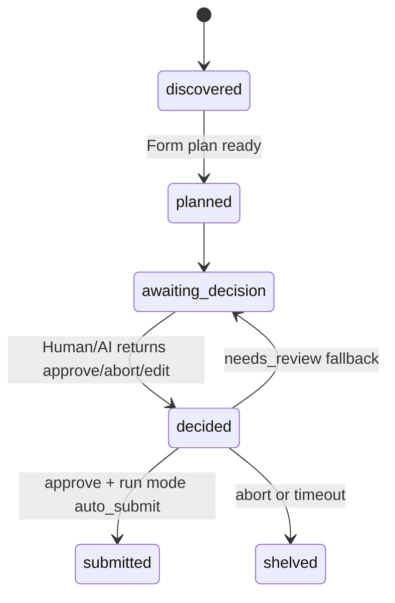
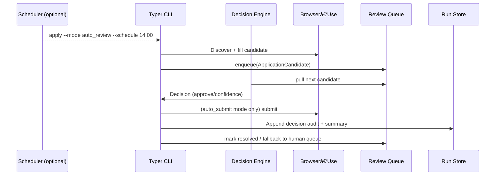

# Core Workflows

```mermaid
sequenceDiagram
  participant U as User
  participant CLI as Typer CLI
  participant BR as Browser-Use
  participant P as Preview (FastAPI)
  participant UI as React UI
  participant G as Google SERP
  participant L as Lever (ATS)

  U->>CLI: apply --source lever-google --limit 2 --profile <id> --mode review
  CLI->>BR: Open Google query (site:jobs.lever.co/apply + filters)
  BR->>G: Collect result anchors and /apply URLs
  BR->>L: Open Lever form, map + fill, upload resume
  BR-->>CLI: Capture pre-submit screenshot + summary
  CLI->>P: POST /api/run/preview (payload)
  UI->>U: Approve/Edit/Abort
  P->>CLI: Decision (review mode only; do not submit)
```
```

- **Session resilience** — after the readiness sequence returns `ready`, the CLI spawns a background copy of the resolved Chrome profile into `.local/browser/backups/<profile>/` and records the outcome in both the console payload (`backups.*`) and `runs/<id>/run.json`. If a subsequent launch detects a corrupt session (missing `Preferences`, launch error) the CLI restores the latest snapshot once before surfacing a fatal error. Operators can disable this behaviour per-run or per-profile when ephemeral sessions are desired.

## Run Modes & Decision Flow

- **Mode selection** happens before the Browser-Use session launches. The CLI resolves `mode` from CLI flag → profile override → global config and records it in `run.json` so the preview UI and history know which guardrails to enforce.
- **Decision engines** share a `SubmissionDecision` contract (`{ outcome: approve|edit_request|abort|needs_review, confidence, rationale, nextActions[] }`).
  - `HumanDecisionEngine` subscribes to preview UI events; the queue pauses while waiting for a person to respond.
  - `LLMDecisionEngine` consumes queue entries asynchronously, scoring each candidate and auto-resolving when confidence ≥ threshold, otherwise returning `needs_review` to fall back to the human queue.
- **Queue states** evolve deterministically: `discovered → planned → awaiting_decision → decided → submitted|shelved`. Queue snapshots are persisted to `run.json.decisions[]` so auto-mode runs can be audited after the fact.



## Auto Review & Full Auto Variants



- **Auto Review (`auto_review`)** stops short of submission. Decisions plus rationale are stored, and the user can resume later via CLI/UI to submit manually.
- **Full Auto (`auto_submit`)** immediately executes approved decisions, but any low-confidence or error state automatically flips the candidate back into the human queue and triggers a notification.

---
