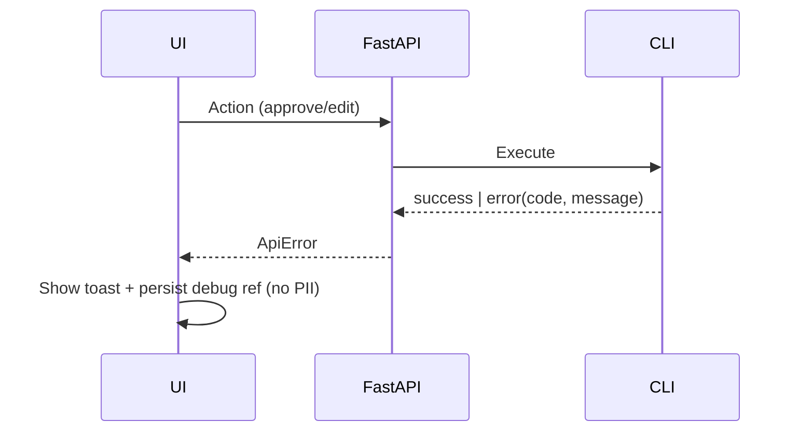

# Error Handling Strategy

## Error Flow


## Error Response Format
```ts
interface ApiError {
  error: {
    code: string;
    message: string;
    details?: Record<string, any>;
    timestamp: string;
    requestId: string;
  };
}
```

## Frontend Error Handling
```ts
export function handleApiError(res: Response): never {
  throw new Error(`api_error_${res.status}`)
}
```

## Backend Error Handling
```py
from fastapi import Request
from fastapi.responses import JSONResponse

class AppError(Exception):
    def __init__(self, code: str, message: str, details: dict | None = None):
        self.code, self.message, self.details = code, message, details or {}

def app_error_handler(request: Request, exc: AppError):
    return JSONResponse(status_code=400, content={
        "error": {
            "code": exc.code,
            "message": exc.message,
            "details": exc.details,
            "timestamp": "{{now}}",
            "requestId": request.headers.get("x-request-id", "local")
        }
    })
```

---
