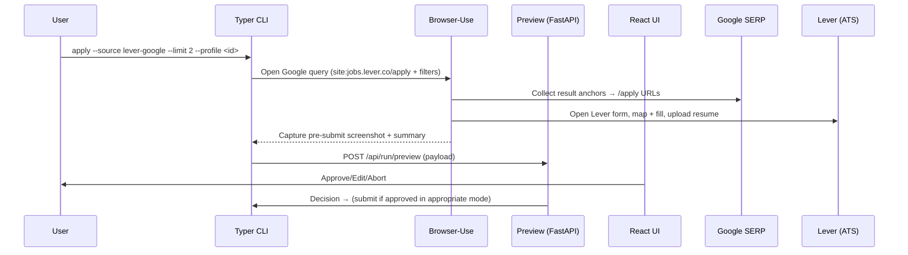

# Sprint Change Proposal — Pivot to Lever via Google SERP

Date: 2025-09-29
Owner: Product Owner (Sarah)
Related: docs/debugging/3.5-quick-apply-live-debug-notes.md

## 1) Identified Issue Summary
- Triggering story: Story 3.5 — Submission Summary & Pre‑Submit Screenshot (Epic 3)
- Problem: SimplyHired “Quick Apply” entry point is inconsistent — the same control frequently resolves to off‑platform ATS flows (Rippling, etc.), defeating our on‑platform fill + summary pipeline.
- Evidence: See debugging notes (2025‑09‑29); repeated `QUICK_APPLY_MISSING` due to redirects to non‑Indeed destinations even when labeled “Quick Apply”.
- Impact: Current discovery strategy wastes cycles and produces brittle results; continuing to harden SimplyHired provides diminishing returns for MVP.

## 2) Epic Impact Summary
- Epic 3 (SimplyHired) is functionally complete from a learnings standpoint (3.1–3.5 delivered), but live success is constrained by the source platform.
- Recommended: Do not roll back Epic 3. Instead, pivot discovery+apply to Lever where the application flow is more uniform across tenants, discovered via Google search filter.
- Epic 4 currently focuses on Human Review Queue & Decision Engine. We propose adding a front‑loaded story to Epic 4 to switch the source provider while preserving the Epic 4 review objectives.

## 3) Artifact Adjustment Needs
Documents to update if we adopt this pivot:
- Architecture
  - docs/architecture/core-workflows.md — replace SH with Google SERP → Lever path; add domain allowlist notes.
  - docs/architecture/components.md — add `sites/lever/*` modules; generalize SimplyHired‑specific mentions.
  - docs/architecture/high-level-architecture.md — diagram: replace "SimplyHired" container with "Google SERP → Lever".
- PRD
  - docs/prd/epic-4-review-gate-submission-integration.md — add a new story for the source pivot.
  - docs/prd/epic-list.md — add a note that post‑Epic 3, the default source is Lever via Google filtered search.
- Snippets
  - New: docs/snippets/lever-and-google-snippets.md (added in this change).

## 4) Recommended Path Forward
- Adopt Google SERP queries constrained to Lever apply pages: `site:jobs.lever.co/apply` + role terms, time‑filtered (past day/week) with `tbs=qdr:*` and paginate via `start`.
- Build a new provider `sites/lever/*` that reuses our mapping/fill/upload pipelines with label‑based selectors; add `jobs.lever.co` (+ optional `api.lever.co`) to profile allowlists.
- Preserve all review artifacts and UX from Epic 3/4 (summary + pre‑submit screenshot feeding the queue).
- Future: consider adding other ATS providers (Greenhouse, Workable) under the same Google SERP strategy.

## 5) Proposed PRD Updates (exact text)

Append to docs/prd/epic-4-review-gate-submission-integration.md:

---

### Story 4.0 — Source Pivot: Google → Lever Apply
As an operator,
I want the agent to discover recent Lever application pages via Google and drive their on‑platform forms,
so that we can continue the review‑first flow with a more uniform, reliable source than SimplyHired.

Acceptance Criteria
1. Discovery uses Google with query `site:jobs.lever.co/apply <terms>` and time window (`qdr:d|w|m`) to collect candidates; paginates via `start`.
2. Results are filtered to `jobs.lever.co` hosts; each result opens either the `/apply` URL directly or the job page then clicks the in‑page "Apply for this job" to reach the form.
3. New Lever provider (`sites/lever/*`) detects common fields by label→control mapping, fills from profile, and uploads resume deterministically.
4. Pre‑submit summary and screenshot are captured exactly as in Story 3.5, feeding the review queue unchanged.
5. Domain guardrails updated for Lever (`jobs.lever.co`, optional `api.lever.co`); single‑tab policy preserved.
6. CLI flag `--source lever-google` selects this provider; default can be toggled via profile.

Notes
- This story deprecates SimplyHired for live runs but leaves code behind for later resurrection or A/B comparison.

---

Append to docs/prd/epic-list.md (under Epic 3/4 transition):

> After Epic 3, the default discovery source pivots from SimplyHired to Google‑filtered Lever apply pages to increase reliability of on‑platform application flows.

## 6) Proposed Architecture Updates (inline snippets)

- docs/architecture/core-workflows.md — sequence diagram



- docs/architecture/high-level-architecture.md — container replacement

```mermaid
flowchart LR
  U[User] --> CLI((CLI Orchestrator))
  subgraph Local Machine (Windows)
    CLI --> PREV[FastAPI Preview Server]
    PREV <-->|HTTP JSON + Static UI| UI[React + Vite]
    CLI --> DEC[Decision Engine]
    DEC --> QUEUE[Review Queue]
    CLI --> BR[Browser‑Use (Playwright)]
    BR --> G[Google SERP]
    BR --> L[Lever Apply]
    CLI --> ART[Artifacts]
    CLI --> HIST[history.jsonl]
    CLI --> DEDUPE[Dedupe]
  end
  G:::ext
  L:::ext
classDef ext fill:#fff,stroke:#999,stroke-dasharray: 5 5
```

- docs/architecture/components.md — add Lever provider note

> New module `sites/lever` mirrors the SimplyHired playbooks (discovery, mapping, fill, upload) but uses Google SERP discovery and label‑based selectors on Lever forms. Profiles must allow `jobs.lever.co` and optionally `api.lever.co`.

## 7) High‑Level Action Plan

1. Create `sites/lever/` with discovery (`lever_google_discovery.py`), selectors (`selectors/*.json`), and form executor.
2. Add profile/template for Lever runs with domain allowlist and default query terms/time window.
3. Wire `--source lever-google` into CLI; default switchable via profile.
4. Update docs per the snippets above (PRD + Architecture) once this proposal is approved.
5. QA: add a gate file mirroring 3.1–3.5 but for Lever (discovery, mapping, fill, upload, summary), plus sample HTML fixtures.

## 8) Open Questions for PO

- Search scope: Which role keywords and locations should we default to? (e.g., "front end", remote vs city/state)
- Time window default: Past day vs past week?
- Submission policy: Keep review‑only (no submit) until Epic 4 completes, correct?
- ATS expansion: Should we queue Greenhouse/Workable next under the same SERP strategy?

## 9) Success Criteria
- ≥80% of discovered candidates land on a Lever `/apply` form without additional navigation.
- Pre‑submit summary + screenshot produced for ≥80% of candidates in review mode.
- No PII leaks in logs; domain guardrails enforced; single‑tab preserved.

---

If approved, I will apply the PRD and Architecture edits above and open a new Epic 4 story file for implementation.
