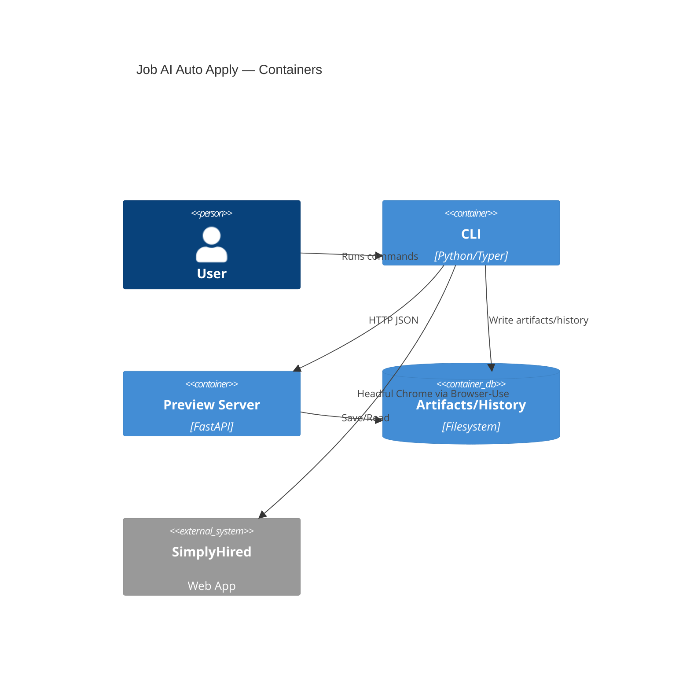
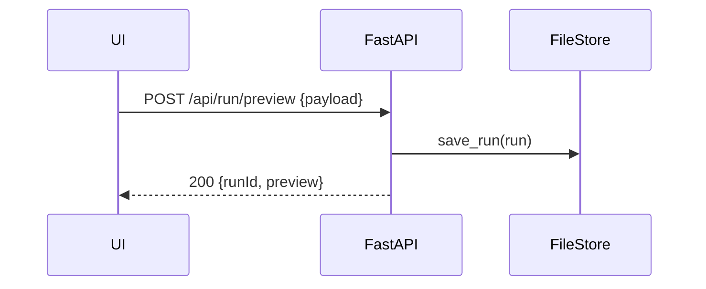
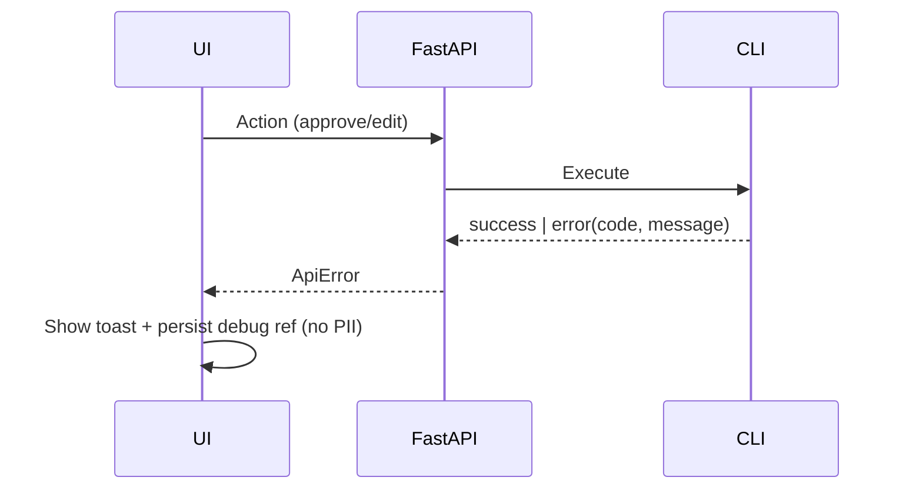

# Job AI Auto Apply Fullstack Architecture Document

## Introduction
This document outlines the complete fullstack architecture for Job AI Auto Apply, including backend systems, frontend implementation, and their integration. It serves as the single source of truth for AI-driven development, ensuring consistency across the entire technology stack.

This unified approach combines what would traditionally be separate backend and frontend architecture documents, streamlining the development process for modern fullstack applications where these concerns are increasingly intertwined.

### Starter Template or Existing Project
N/A — Greenfield project.

## Change Log
| Date       | Version | Description                                    | Author   |
|------------|---------|------------------------------------------------|----------|
| 2025-09-25 | v0.1    | Initial architecture skeleton from template    | Winston  |
| 2025-09-26 | v0.2    | Completed fullstack architecture in YOLO mode | Winston  |

---

## High Level Architecture

### Technical Summary
- Architecture: Local-first, privacy-preserving monolith with clear modular boundaries. Python (Typer CLI + FastAPI preview server) orchestrates the full flow; a small React + Vite UI runs as static assets served by FastAPI.
- Frontend: React 18 + Vite + Tailwind + shadcn/ui, focused on a single Preview window to Approve/Edit/Abort. UI is small, offline-first, and keyboard-centric.
- Backend: FastAPI app embedded alongside the CLI process provides Preview routes, serves static UI, and exposes a minimal REST API for the UI to control runs and edits.
- Browser automation: Headful Chrome via Browser‑Use + Playwright with a stealth posture, single-tab, profile-specific persistent session, and deterministic fallbacks for uploads/widgets.
- Storage: File-first artifacts (screenshots/video optional), `run.json`, HTML snapshots, and `history.jsonl`. Optional local SQLite index can be introduced later for search/analytics; not needed for MVP.
- Goals alignment: Meets PRD privacy (local-only PII), reliability (95% success, retry), performance (≤120s median), and dedupe requirements with auditability.

### Platform and Infrastructure Choice
**Options considered**
- Local Desktop (Windows) only: No external hosting; dev CI via GitHub Actions.
- Vercel + Supabase: Great for web apps, conflicts with privacy constraints (PII cloud storage).
- AWS/GCP/Azure: Powerful but unnecessary for MVP; increases cost/scope; privacy trade-offs.

**Recommendation**
- Platform: Local Desktop (Windows 10/11). No cloud data storage. Optional GitHub Actions for CI (tests/build only, no PII).
- Key Services: Windows filesystem, Chrome Stable, Playwright (Chromium), Python 3.11 runtime, Node 22 for building UI only.
- Deployment Host and Regions: N/A (local-only).

### Repository Structure
- Structure: Monorepo with Python + Node subprojects; file-first storage.
- Monorepo Tool: pnpm workspaces for UI; Python managed by `uv` or `venv` (documented), no polyglot mega-tooling required.
- Package Organization: `apps/cli` (Typer + orchestration), `apps/preview` (FastAPI), `apps/ui` (React), `sites/simplyhired` (playbooks/locators), `packages/shared` (TS types used by UI; Python shares pydantic models locally).

### High Level Architecture Diagram
```mermaid
flowchart LR
    U[User] -->|CLI args
    | Typer | CLI((CLI Orchestrator))
    subgraph Local Machine (Windows)
      CLI --> PREV[FastAPI Preview Server]
      PREV <-->|HTTP JSON + Static UI| UI[React + Vite (shadcn/ui)]
      CLI --> BR[Browser‑Use (Playwright, Chrome headful)]
      BR --> SH[SimplyHired Quick Apply]
      CLI --> ART[Artifacts Store (screenshots, run.json, logs)]
      CLI --> HIST[history.jsonl]
      CLI --> DEDUPE[Dedupe Fingerprint]
    end
    SH:::ext

classDef ext fill:#fff,stroke:#999,stroke-dasharray: 5 5
```

### Architectural Patterns
- Jamstack‑style UI: Static UI served by local FastAPI for simplicity and speed — Rationale: Zero external hosting, fast load, minimal surface.
- Modular Monolith: Python app segmented into domain modules (config, profiles, browser, preview, artifacts) — Rationale: Lower complexity than services, easy local ops.
- BFF (Backend for Frontend): Preview server mediates UI ↔ CLI — Rationale: Stable API boundary, testable UI.
- Repository Pattern (File‑based): Encapsulate read/write of artifacts/history — Rationale: Enables swap to SQLite later without UI/CLI churn.
- Circuit Breaker/Retry on Submission: Controlled single retry on failure — Rationale: Hit reliability target without infinite loops.
- Deterministic Fallbacks: Playwright scripted steps for uploads/widgets — Rationale: Resilience when LLM actions drift.

---

## Tech Stack

### Technology Stack Table
| Category | Technology | Version | Purpose | Rationale |
|---|---|---|---|---|
| Frontend Language | TypeScript | 5.6 | UI type safety | Mature ecosystem; integrates with Vite and shadcn/ui |
| Frontend Framework | React | 18.2 | Preview UI | Stable, well-documented, minimal runtime needs |
| UI Component Library | shadcn/ui + Tailwind CSS | shadcn (template) + 3.4 | Accessible, consistent UI | Fast to assemble, accessible components |
| State Management | Zustand | 4.x | Lightweight UI state | Simple store, minimal boilerplate |
| Backend Language | Python | 3.11 | CLI + server | Matches PRD; great ecosystem |
| Backend Framework | FastAPI | 0.115.x | Preview server REST + static | Async, type hints, easy testing |
| API Style | REST (JSON) | n/a | UI ↔ Preview control | Simple, predictable, debuggable |
| Database | None (file-first) | n/a | Artifacts/history storage | Meets privacy constraints; SQLite optional later |
| Cache | In‑process | n/a | Small ephemeral caches | Avoids external services |
| File Storage | Windows FS | n/a | Artifacts, logs | Local‑only privacy |
| Authentication | API key (.env.local) | n/a | OpenRouter access | No user auth needed locally |
| Frontend Testing | Vitest + RTL + axe | latest | Unit/a11y tests | Fast local CI, a11y coverage |
| Backend Testing | pytest | 8.x | Unit/integration | Mature, fixtures, Windows friendly |
| E2E Testing | Playwright | 1.46+ | UI/E2E (optional) | Same engine as automation; visual baseline optional |
| Build Tool | Vite | 5.x | Frontend dev/build | Fast dev server, simple static output |
| Bundler | esbuild (via Vite) | 0.21+ | Fast builds | Defaults suffice |
| IaC Tool | None | n/a | Local‑only | No infra to codify |
| CI/CD | GitHub Actions | hosted | Test/build only | No PII; gates quality |
| Monitoring | Local logs + metrics | n/a | Observability | No external telemetry |
| Logging | JSON logs | n/a | Debug + audit | PII redaction rules |
| CSS Framework | Tailwind CSS | 3.4 | Utility CSS | Pairs with shadcn/ui |

---

## Data Models

### Profile
**Purpose:** Encapsulate per‑role identity, Q&A overrides, and resume path.

**Key Attributes:**
- `id`: string — profile slug
- `resumePath`: string — path to PDF
- `qaOverrides`: Record<string,string> — question→answer map

#### TypeScript Interface
```ts
export interface Profile {
  id: string;
  displayName: string;
  documents: {
    resumePath: string;
  };
  qaOverrides?: Record<string, string>;
  userDataDir: string; // persistent Chrome session dir
}
```

#### Relationships
- Used by Run to parameterize automation

### JobPosting
**Purpose:** Captured metadata and full description for dedupe and audit.

**Key Attributes:**
- `postingUrl`: string — canonical URL
- `title`: string — job title

#### TypeScript Interface
```ts
export interface JobPosting {
  postingUrl: string;
  title: string;
  company?: string;
  location?: string;
  descriptionText: string;
  descriptionHtmlPath: string; // stored snapshot
}
```

#### Relationships
- Referenced by Run; fingerprint computed from `postingUrl + sha256(descriptionText)`

### Run
**Purpose:** Single application attempt with artifacts and outcomes.

**Key Attributes:**
- `id`: string — run id
- `profileId`: string — link to Profile
- `status`: `pending|review|submitting|success|error`

#### TypeScript Interface
```ts
export interface RunRecord {
  id: string;
  startedAt: string;
  profileId: string;
  posting: JobPosting;
  preview: {
    screenshotPath?: string;
    edits?: string;
    approved: boolean;
    dryRun: boolean;
  };
  submission?: {
    submittedAt?: string;
    confirmation?: string;
    error?: string;
    retried?: boolean;
  };
  artifactsDir: string;
  logsPath: string; // redacted step log
}
```

#### Relationships
- Appended summary written to `history.jsonl`

---

## API Specification (REST)

```yaml
openapi: 3.0.0
info:
  title: Job AI Auto Apply Preview API
  version: 0.1.1
  description: Local-only API for UI ↔ preview server control
servers:
  - url: http://localhost:4950
    description: Local development/usage
paths:
  /api/run/preview:
    post:
      summary: Create a preview run
      requestBody:
        required: true
        content:
          application/json:
            schema:
              type: object
              properties:
                searchUrl: { type: string }
                limit: { type: integer, default: 2 }
                profileId: { type: string }
                dryRun: { type: boolean, default: true }
      responses:
        '200':
          description: OK
          content:
            application/json:
              schema:
                type: object
                properties:
                  runId: { type: string }
                  status: { type: string, enum: [pending, review, submitting, submitted, error, aborted, duplicate] }
                  preview:
                    type: object
                    properties:
                      screenshotUrl: { type: string }
                      summary: { type: string }
  /api/run/{id}:
    get:
      summary: Get run preview state
      parameters:
        - in: path
          name: id
          required: true
          schema: { type: string }
      responses:
        '200': { description: OK }
  /api/run/{id}/approve:
    post:
      summary: Approve and submit
      parameters:
        - in: path
          name: id
          required: true
          schema: { type: string }
      responses:
        '200': { description: OK }
  /api/run/{id}/edit:
    post:
      summary: Apply a small textual edit and retry once
      parameters:
        - in: path
          name: id
          required: true
          schema: { type: string }
      requestBody:
        required: true
        content:
          application/json:
            schema:
              type: object
              properties:
                text: { type: string }
      responses:
        '200': { description: OK }
  /api/run/{id}/abort:
    post:
      summary: Abort current run
      parameters:
        - in: path
          name: id
          required: true
          schema: { type: string }
      responses:
        '200': { description: OK }
  /api/run/{id}/updates:
    get:
      summary: Poll recent events
      parameters:
        - in: path
          name: id
          required: true
          schema: { type: string }
        - in: query
          name: since
          required: false
          schema: { type: string }
      responses:
        '200': { description: OK }
components:
  schemas:
    ApiError:
      type: object
      properties:
        error:
          type: object
          properties:
            code: { type: string }
            message: { type: string }
            details: { type: object }
            timestamp: { type: string }
            requestId: { type: string }
```

---

## Components

### CLI Orchestrator
**Responsibility:** Parse args, load config/profile, coordinate browser actions, manage artifacts/history.

**Key Interfaces:**
- Commands: `apply`, `profiles`, `config`, `history`
- IPC/HTTP calls to Preview server

**Dependencies:** Config loader, Profile manager, Browser‑Use wrapper, Artifact store

**Technology Stack:** Python 3.11, Typer

### Preview Server (BFF)
**Responsibility:** Serve UI, provide preview control endpoints, enforce guardrails.

**Key Interfaces:** `/api/run/*`, `/ui/*`

**Dependencies:** File repository, redaction utilities

**Technology Stack:** FastAPI, Uvicorn (embedded)

### Browser‑Use Controller
**Responsibility:** Headful Chromium automation with stealth posture; deterministic fallbacks for upload/widgets.

**Key Interfaces:** High-level actions (visit, detect Quick Apply, fill forms, upload resume, collect review screenshot)

**Dependencies:** Playwright, model driver (OpenRouter key)

**Technology Stack:** Browser‑Use + Playwright (Python)

### Artifact & History Store
**Responsibility:** Persist screenshots, `run.json`, HTML snapshot, redacted `actions.log`, append `history.jsonl`.

**Key Interfaces:** `save_run(run)`, `append_history(entry)`, `housekeep(retentionDays)`

**Dependencies:** Windows filesystem

**Technology Stack:** Python repository module (file‑based)

### Dedupe Service
**Responsibility:** Compute fingerprint, enforce 30‑day window, bypass when expired.

**Key Interfaces:** `should_skip(posting)`, `record_fingerprint(posting)`

**Dependencies:** Hashing, history/history.jsonl

**Technology Stack:** Python utility module



---

## External APIs

### OpenRouter API
- **Purpose:** LLM actions for Browser‑Use when needed
- **Documentation:** https://openrouter.ai
- **Base URL(s):** https://openrouter.ai/api/v1
- **Authentication:** API key from `.env.local`
- **Rate Limits:** Subject to provider; keep low default concurrency

**Key Endpoints Used:**
- POST `/chat/completions` (or provider‑specific routes via OpenRouter)

**Integration Notes:**
- Redact PII in prompts/logging; retry/backoff; allow per‑profile model override.

If no external APIs are configured, the system operates with deterministic Playwright fallbacks only.

---

## Core Workflows

### Review‑First Apply (Sequence)
```mermaid
sequenceDiagram
  participant U as User
  participant CLI as Typer CLI
  participant BR as Browser‑Use
  participant P as Preview (FastAPI)
  participant UI as React UI
  participant SH as SimplyHired

  U->>CLI: apply --search <url> --limit 2 --profile <id> --dry-run
  CLI->>BR: Navigate search, detect Quick Apply, open flow
  BR->>SH: Fill forms (stealth pacing), upload resume
  BR-->>CLI: Capture final review screenshot + details
  CLI->>P: POST /api/run/preview (payload)
  UI->>U: Show screenshot + summary (Approve/Edit/Abort)
  U->>P: Approve or Edit or Abort
  P->>CLI: Approve → proceed to submit (or Edit once, then retry)
  CLI->>BR: Submit; on error → retry once; else success
  CLI->>Artifacts: Save run.json, screenshots, logs; append history.jsonl
```

---

## Database Schema

MVP uses file‑first storage. JSON Schemas help validate structure; optional SQLite index can be added later without changing contracts.

### Data Contracts (JSON Schema)

#### RunRecord — `runs/<id>/run.json`
```json
{
  "$schema": "https://json-schema.org/draft/2020-12/schema",
  "$id": "urn:schema:run-record:1-0-0",
  "title": "RunRecord",
  "type": "object",
  "required": ["id", "startedAt", "profileId", "posting", "artifactsDir", "logsPath", "status"],
  "properties": {
    "id": { "type": "string" },
    "startedAt": { "type": "string", "format": "date-time" },
    "profileId": { "type": "string" },
    "status": { "type": "string", "enum": ["pending", "review", "submitting", "submitted", "error", "aborted", "duplicate"] },
    "posting": {
      "type": "object",
      "required": ["postingUrl", "descriptionText", "descriptionHtmlPath"],
      "properties": {
        "postingUrl": { "type": "string", "format": "uri" },
        "title": { "type": "string" },
        "company": { "type": "string" },
        "location": { "type": "string" },
        "descriptionText": { "type": "string" },
        "descriptionHtmlPath": { "type": "string" }
      }
    },
    "preview": {
      "type": "object",
      "properties": {
        "screenshotPath": { "type": "string" },
        "edits": { "type": "string" },
        "approved": { "type": "boolean" },
        "dryRun": { "type": "boolean" }
      }
    },
    "submission": {
      "type": "object",
      "properties": {
        "submittedAt": { "type": "string", "format": "date-time" },
        "confirmation": { "type": "string" },
        "error": { "type": "string" },
        "retried": { "type": "boolean" }
      }
    },
    "artifactsDir": { "type": "string" },
    "logsPath": { "type": "string" }
  }
}
```

#### HistoryEntry — `history/history.jsonl` (one JSON per line)
```json
{
  "$schema": "https://json-schema.org/draft/2020-12/schema",
  "$id": "urn:schema:history-entry:1-0-0",
  "title": "HistoryEntry",
  "type": "object",
  "required": ["id", "timestamp", "profileId", "postingUrl", "fingerprint", "status"],
  "properties": {
    "id": { "type": "string" },
    "timestamp": { "type": "string", "format": "date-time" },
    "profileId": { "type": "string" },
    "postingUrl": { "type": "string", "format": "uri" },
    "searchUrl": { "type": "string", "format": "uri", "nullable": true },
    "jobTitle": { "type": "string", "nullable": true },
    "company": { "type": "string", "nullable": true },
    "location": { "type": "string", "nullable": true },
    "source": { "type": "string", "enum": ["simplyhired"] },
    "fingerprint": { "type": "string" },
    "status": { "type": "string", "enum": ["submitted", "failed", "aborted", "skipped", "duplicate", "error"] },
    "confirmation": { "type": "string", "nullable": true },
    "error": { "type": "string", "nullable": true },
    "runPath": { "type": "string", "nullable": true },
    "screenshots": { "type": "array", "items": { "type": "string" }, "nullable": true }
  }
}
```

---

## Frontend Architecture

### Component Architecture
- Organization: Small, focused components in `apps/ui/src`; shadcn/ui primitives; feature folders for preview.

```text
apps/ui/src/
  components/
    PreviewCard.tsx
    Toolbar.tsx
  features/preview/
    PreviewScreen.tsx
    EditDialog.tsx
    store.ts
  lib/
    api.ts
    errors.ts
  main.tsx
```

#### Component Template
```tsx
import { Card } from "@/components/ui/card";

export function PreviewCard({ screenshotUrl, summary }: { screenshotUrl: string; summary: string }) {
  return (
    <Card className="p-4 space-y-3">
      
      <pre className="text-sm whitespace-pre-wrap">{summary}</pre>
    </Card>
  );
}
```

### State Management Architecture
- Zustand store for simple UI state and API calls; no global framework deps.

```ts
import { create } from "zustand";

interface PreviewState {
  runId?: string;
  status: "idle" | "loading" | "ready" | "submitting" | "error";
  error?: string;
  set: (p: Partial<PreviewState>) => void;
}

export const usePreview = create<PreviewState>((set) => ({
  status: "idle",
  set: (p) => set(p),
}));
```

### Routing Architecture
- React Router optional; MVP can be single‑route `/ui`.

### Frontend Services Layer
```ts
// apps/ui/src/lib/api.ts
export async function approve(runId: string) {
  const res = await fetch(`/api/run/${runId}/approve`, { method: "POST" });
  if (!res.ok) throw new Error("approve_failed");
}
```

---

## Backend Architecture

### Service Architecture (Traditional Server)
- FastAPI app mounted inside CLI process; threads for server lifecycle if needed.
- Routes under `/api/run/*`; static UI under `/ui/*`.

```py
# apps/preview/main.py
from fastapi import FastAPI
app = FastAPI()

@app.post("/api/run/preview")
async def start_preview(payload: dict):
    # validate, persist, return preview payload
    return {"ok": True}
```

### Database Architecture (File Repository)
- `runs/{runId}/...` folder per run
- `history/history.jsonl` append‑only with file lock

```py
# repositories/file_store.py
class FileStore:
    def save_run(self, run): ...
    def append_history(self, entry): ...
```

### Authentication and Authorization
- No user auth; local‑only.
- OpenRouter API key loaded from `.env.local` when LLM is used.



---

## Unified Project Structure

```text
job-ai-auto-apply/
├─ apps/
│  ├─ cli/                    # Typer CLI (Python)
│  ├─ preview/                # FastAPI BFF + static serving
│  └─ ui/                     # React + Vite + Tailwind + shadcn/ui
├─ packages/
│  └─ shared/                 # Shared TS types for UI
├─ sites/
│  └─ simplyhired/            # Playbooks, selectors, widgets
├─ runs/                      # Per-run artifact directories (created at runtime)
├─ history/
│  └─ history.jsonl           # Append-only run summaries
├─ config/                    # config.yaml (generated)
├─ data/
│  └─ profiles/               # per-profile YAML + resume PDFs
├─ .local/                    # browser sessions per profile
├─ docs/
│  ├─ prd.md
│  └─ architecture.md
├─ package.json               # pnpm workspaces for apps/ui + packages
├─ pnpm-workspace.yaml
├─ pyproject.toml             # Python project config
└─ .env.local                 # OpenRouter API key (local only)
```

---

## Development Workflow

### Local Development Setup
```bash
# Prerequisites
# - Windows 10/11
# - Python 3.11+
# - Node.js 22 LTS + pnpm 9
# - Chrome stable
# - Playwright browsers: npx playwright install chromium
```

```bash
# Initial Setup
python -m venv .venv && .\.venv\Scripts\pip install -U pip
pip install -e .[dev]
cd apps/ui && pnpm install && pnpm build && cd ../..
# Copy UI build into preview static dir if needed (or serve directly)
```

```bash
# Development Commands
# Start preview server (port 4950)
python -m apps.preview --demo
# Start CLI dry-run example
python -m apps.cli apply --search "<simplyhired-search-url>" --limit 2 --profile default --dry-run
# Run tests
pytest -q
cd apps/ui && pnpm test
```

### Environment Configuration
```bash
# .env.local (read locally; never commit)
OPENROUTER_API_KEY=...
OPENROUTER_MODEL=deepseek/deepseek-chat-v3.1:free
# Optional
LOG_LEVEL=INFO
ARTIFACTS_KEEP_DAYS=30
```

---

## Deployment Architecture

### Deployment Strategy
- Frontend Deployment:
  - Platform: Local static assets served by FastAPI
  - Build Command: `pnpm --filter @app/ui build`
  - Output Directory: `apps/ui/dist`
  - CDN/Edge: N/A (local)

- Backend Deployment:
  - Platform: Local Python runtime (pipx/venv) or packaged executable
  - Build Command: `pip install -e .` (dev) / PyInstaller for single‑exe (optional)
  - Deployment Method: Zip distribution or installer; no network services created

### CI/CD Pipeline (GitHub Actions excerpt)
```yaml
name: ci
on: [push, pull_request]
jobs:
  test:
    runs-on: windows-latest
    steps:
      - uses: actions/checkout@v4
      - uses: actions/setup-python@v5
        with: { python-version: '3.11' }
      - run: pip install -e .[dev]
      - run: pytest -q
      - uses: actions/setup-node@v4
        with: { node-version: '22' }
      - run: cd apps/ui && pnpm install && pnpm build && pnpm test
```

### Environments
| Environment | Frontend URL | Backend URL | Purpose |
|---|---|---|---|
| Development | http://localhost:4950/ui | http://localhost:4950 | Local development |
| Staging | N/A | N/A | Not applicable (local-only) |
| Production | N/A | N/A | Distributed locally |

---

## Security and Performance

### Security Requirements
**Frontend Security**
- CSP: default-src 'self'; img-src 'self' blob: data:; connect-src 'self'; frame-ancestors 'none'
- XSS: sanitize any dynamic HTML views; no untrusted HTML rendering in MVP
- Secure Storage: Avoid localStorage for secrets; none needed for MVP

**Backend Security**
- Input Validation: pydantic models for all API routes
- Rate Limiting: Not required (local); guard against rapid repeat actions
- CORS: Same‑origin only

**Authentication Security**
- OpenRouter: Key from `.env.local`; never persisted in artifacts
- Logs: PII redaction in `actions.log`; only `run.json` stores PII

### Performance Optimization
**Frontend**
- Bundle target ≤ 200KB gzipped for MVP
- Loading: single route, static assets; prefetch UI
- Caching: HTTP cache headers for static files

**Backend**
- Response Time Target: Preview API ≤ 50ms p50
- Database Optimization: N/A (file I/O); minimize sync blocking
- Caching: In‑process memo for small lookups

---

## Testing Strategy

### Testing Pyramid
```
E2E Tests
/        \
Integration Tests
/            \
Frontend Unit  Backend Unit
```

### Test Organization
```text
apps/ui/src/__tests__/...
apps/preview/tests/...
core/tests/...
```

### Test Examples
```ts
// Frontend Component Test (Vitest + RTL)
import { render, screen } from '@testing-library/react'
import { PreviewCard } from '@/components/PreviewCard'

test('renders screenshot', () => {
  render(<PreviewCard screenshotUrl="/shot.png" summary="ok" />)
  expect(screen.getByAltText('Final review screenshot')).toBeInTheDocument()
})
```

```py
# Backend API Test (pytest)
from fastapi.testclient import TestClient
from apps.preview.main import app

client = TestClient(app)

def test_preview_route():
    r = client.post('/api/run/preview', json={"searchUrl": "https://...", "limit": 1, "profileId": "default", "dryRun": True})
    assert r.status_code == 200
```

```ts
// E2E Test (Playwright) — optional local
import { test, expect } from '@playwright/test'

test('ui loads', async ({ page }) => {
  await page.goto('http://localhost:4950/ui')
  await expect(page.getByRole('button', { name: 'Approve' })).toBeVisible()
})
```

---

## Coding Standards

### Critical Fullstack Rules
- Type Sharing: TS types in `packages/shared`; Python pydantic models in backend — keep contracts aligned.
- API Calls: UI must call only Preview BFF endpoints; no direct filesystem access.
- Env Vars: Access via config objects; never use `process.env` directly in components; backend reads `.env.local` once.
- Error Handling: Use standard `ApiError` shape across stack; no throw strings.
- State Updates: Use Zustand immutable updates; no direct mutation.
- Guardrails: Browser automation restricted to `*.simplyhired.com`; one tab; headful only.

### Naming Conventions
| Element | Frontend | Backend | Example |
|---|---|---|---|
| Components | PascalCase | - | `PreviewCard.tsx` |
| Hooks | camelCase with `use` | - | `usePreview.ts` |
| API Routes | - | kebab-case | `/api/run-preview` (or RESTful `/api/run/preview`) |
| Files/Modules | kebab-case | snake_case | `artifact-store.ts`, `file_store.py` |

---

## Error Handling Strategy

### Error Flow


### Error Response Format
```ts
interface ApiError {
  error: {
    code: string;
    message: string;
    details?: Record<string, any>;
    timestamp: string;
    requestId: string;
  };
}
```

### Frontend Error Handling
```ts
export function handleApiError(res: Response): never {
  throw new Error(`api_error_${res.status}`)
}
```

### Backend Error Handling
```py
from fastapi import Request
from fastapi.responses import JSONResponse

class AppError(Exception):
    def __init__(self, code: str, message: str, details: dict | None = None):
        self.code, self.message, self.details = code, message, details or {}

def app_error_handler(request: Request, exc: AppError):
    return JSONResponse(status_code=400, content={
        "error": {
            "code": exc.code,
            "message": exc.message,
            "details": exc.details,
            "timestamp": "{{now}}",
            "requestId": request.headers.get("x-request-id", "local")
        }
    })
```

---

## Monitoring and Observability

### Monitoring Stack
- Frontend Monitoring: Console warnings surfaced in UI dev; optional local log capture
- Backend Monitoring: Structured JSON logs with log level; timing for key steps
- Error Tracking: Local log files only; no cloud
- Performance Monitoring: Simple timings for navigation, fill, submit, preview render

### Key Metrics
**Frontend**
- Paint time of `/ui` route
- Action latency: button press → API response
- JS runtime errors count

**Backend**
- Request rate and latency per endpoint
- Success/error ratio for submit actions
- Average artifact write times

---

## Checklist Results Report
Summary: Architecture adheres to PRD goals (local‑first, privacy, Windows focus). Monorepo + modular monolith minimizes complexity, while BFF cleanly separates UI concerns. File‑first storage meets privacy with room to evolve. Guardrails and fallbacks support reliability.

Open Questions/Next Decisions
- UI build integration path (copy to preview vs serve from UI dev server during dev)
- Optional SQLite index for history search (post‑MVP)
- Packaging approach (PyInstaller vs leave as Python project)
